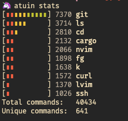

> We have since released patch v13.0.1. v13 had a regression exposed when trying to register a new user. This would only affect people self-hosting Atuin Server. Please update!

Announcing a new release of Atuin! v13 is out now. Atuin allows you to easily search and sync your shell history across many machines.

You can update your installation via your system package manager, or by downloading the latest release from the [release page](https://github.com/ellie/atuin/releases).

We had a lot of changes in this release - I'll call out a few, but this is not exhaustive.


## Crossterm

Deserving of a special callout, we now use [Crossterm](https://github.com/ellie/atuin/pull/331) as our TUI backend - this has been a huge effort, and has taken almost a year. Thank you to Conrad for pushing through it, and [@pdecat](https://github.com/pdecat) for your contributions!

In the future this will allow for things like (possible) Windows support, and only using a small part of the screen for the search UI. It also handles async input better.

Please let us know if you experience any issues! 

## New features

### Pretty Stats

<center>

  

</center>

While procrastinating writing [his talk](https://www.youtube.com/watch?v=7pU3gOVAeVQ), Conrad [added](https://github.com/ellie/atuin/pull/707) a new and improved stats display! Just run `atuin stats` to see your statistics. It'd be awesome to see what yours looks like, so please share it with us on [Twitter](https://twitter.com/atuinsh) or [Discord](https://discord.gg/Fq8bJSKPHh)!

### Custom history list format
List history however you want! You can now specify the output format of `atuin history list`

Example

```
atuin history list --format "{time} - [{duration}] - {directory}$\t{command}"
```

See more on the [docs page](/docs/commands/list)!

### History filter
The history filter allows you to exclude commands from history tracking - maybe you want to keep ALL of your `curl` commands totally out of your shell history, or maybe just some matching a pattern. 

This supports regular expressions, so you can hide pretty much whatever you want! Thanks for the PR @jbaiter

Configure it in your client-side Atuin config, for example

```
## Note that these regular expressions are unanchored, i.e. if they don't start
## with ^ or end with $, they'll match anywhere in the command.
history_filter = [
   "^secret-cmd",
   "^innocuous-cmd .*--secret=.+"
]
```

### Mnemonic key (BIP39)
Previously, it was awkward to copy your Atuin key from machine to machine. Even more awkward to back it up!

We now use BIP39 to display your key in a nice + easily readable haiku-style format. Still - please don't share it!

## Improvements
- Better error messages
- Nix install files + instructions
- Exit when pushing the down arrow from the most recent entry
- Refactor to support generic server-side databases
- Make it easier to disable the ctrl-r and/or up arrow bindings
- Update to axum6

## Fixes
- Fish now handles multi-line commands properly
- Listing history for the current session now works
- Fix `atuin init` for Fish

## Contributor Shoutout!

### [@patricksjackson](https://github.com/patricksjackson)
* Fix minor typo in config.md in https://github.com/ellie/atuin/pull/615
* Re-enable arm docker builds in https://github.com/ellie/atuin/pull/616
* Handle multiline commands in fish shell in https://github.com/ellie/atuin/pull/623
* install.sh: Fallback to using cargo in https://github.com/ellie/atuin/pull/639
* Fix session history listing in https://github.com/ellie/atuin/pull/620

### [@pdecat](https://github.com/pdecat)
* Add support for some additional keys in interactive mode in https://github.com/ellie/atuin/pull/634
* Allow overriding filter and search modes from CLI in https://github.com/ellie/atuin/pull/635

### [@Sciencentistguy](https://github.com/Sciencentistguy)
* Rework `atuin init` in https://github.com/ellie/atuin/pull/652
* Improve error message when $AUTIN_SESSION is not set. in https://github.com/ellie/atuin/pull/654
* Add nix files and install instructions in https://github.com/ellie/atuin/pull/477

### [@BapRx](https://github.com/BapRx)
* chore(#621): Exit atuin when pressing down arrow on most recent entry in https://github.com/ellie/atuin/pull/659
* docs: Remove human short flag from docs, duplicate of help -h in https://github.com/ellie/atuin/pull/663
* feat(history): Add new flag to allow custom output format in https://github.com/ellie/atuin/pull/662

### [@yolo2h](https://github.com/yolo2h)
* docs: Fix typo in zh-CN/README.md in https://github.com/ellie/atuin/pull/666

### [@s1ck](https://github.com/s1ck)
* Fix CI build badge in https://github.com/ellie/atuin/pull/683

### [@conradludgate](https://github.com/conradludgate)
* display mnemonic key in https://github.com/ellie/atuin/pull/694
* axum6 with typesafe state in https://github.com/ellie/atuin/pull/674
* crossterm support in https://github.com/ellie/atuin/pull/331
* stats in https://github.com/ellie/atuin/pull/707

### [@evanpurkhiser](https://github.com/evanpurkhiser)
* Remove whitespace in template client config.tom in https://github.com/ellie/atuin/pull/697
* Fix missing `-` in key-binding.md in https://github.com/ellie/atuin/pull/698

### [@eripa](https://github.com/eripa)
* docs(README): add static activity graph example by @eripa in https://github.com/ellie/atuin/pull/680

### [@trygveaa](https://github.com/trygveaa)
* Allow using existing key file on login by @trygveaa in https://github.com/ellie/atuin/pull/688

### [@frukto](https://github.com/frukto)
* Make the install script more robust by @frukto in https://github.com/ellie/atuin/pull/692

### [@jbaiter](https://github.com/jbaiter)
* Add `history_filter` setting to exclude commands from history by @jbaiter in https://github.com/ellie/atuin/pull/716

### [@hunger](https://github.com/hunger)
* fish: Fix `atuin init` for the fish shell by @hunger in https://github.com/ellie/atuin/pull/699

### [@ekroon](https://github.com/ekroon)
* Add support for generic database in AppState by @ekroon in https://github.com/ellie/atuin/pull/711


## New Contributors
I very much appreciate the work from all contributors, but a special mention to everyone who made their _first_ contribution in this release, no matter how large or small

* [@pdecat](https://github.com/pdecat) made their first contribution in https://github.com/ellie/atuin/pull/634
* [@BapRx](https://github.com/BapRx) made their first contribution in https://github.com/ellie/atuin/pull/659
* [@yolo2h](https://github.com/yolo2h) made their first contribution in https://github.com/ellie/atuin/pull/666
* [@s1ck](https://github.com/s1ck) made their first contribution in https://github.com/ellie/atuin/pull/683
* [@evanpurkhiser](https://github.com/evanpurkhiser) made their first contribution in https://github.com/ellie/atuin/pull/697
* [@eripa](https://github.com/eripa) made their first contribution in https://github.com/ellie/atuin/pull/680
* [@trygveaa](https://github.com/trygveaa) made their first contribution in https://github.com/ellie/atuin/pull/688
* [@frukto](https://github.com/frukto) made their first contribution in https://github.com/ellie/atuin/pull/692
* [@jbaiter](https://github.com/jbaiter) made their first contribution in https://github.com/ellie/atuin/pull/716
* [@hunger](https://github.com/hunger) made their first contribution in https://github.com/ellie/atuin/pull/699
* [@ekroon](https://github.com/ekroon) made their first contribution in https://github.com/ellie/atuin/pull/711

## Future plans
I've been talking about it for ages and ages, but now that my life has _finally_ settled down I'm going to be focusing on getting [deletions](https://github.com/ellie/atuin/issues/592) out for the next release. We will be switching to an event-based sync, which should allow for many more features and cool things in the future!

## Other changes

### Talk
I spoke about Atuin at FOSDEM! If you want to know more about the project + video is your thing, you can watch it here

<iframe width="560" height="315" src="https://www.youtube.com/embed/uyRmV19qJ2o" title="YouTube video player" frameborder="0" allow="accelerometer; autoplay; clipboard-write; encrypted-media; gyroscope; picture-in-picture; web-share" allowfullscreen></iframe>

### Website

Well... this is new. Previously I never bothered writing much about new releases, and basically just used the autogenerated GitHub release. The docs should be much easier to find here too!

### Twitter

I also opened a Twitter account for Atuin - [@atuinsh](https://twitter.com/atuinsh)

If you fancy chatting to us about anything here, or otherwise, please feel free to drop by the [Discord](https://discord.gg/Fq8bJSKPHh)!

**Full Changelog**: https://github.com/ellie/atuin/compare/v12.0.0...v13.0.0
