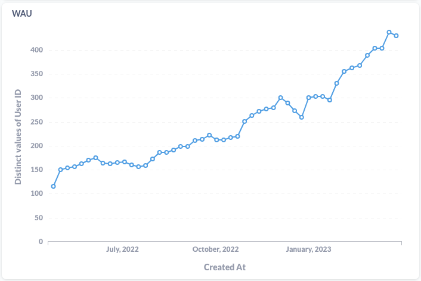
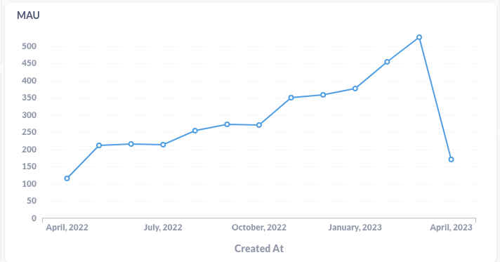

Announcing a new release of Atuin! v14 is out now. Atuin allows you to easily search and sync your shell history across many machines.

You can update your installation via your system package manager, or by downloading the latest release from the [release page](https://github.com/ellie/atuin/releases).

This release introduces some breaking changes, so please ensure all Atuin clients and servers are updated or sync may not complete.

We had a lot of changes in this release - I'll call out a few, but this is not exhaustive. Read the changelog below for the full list!

### Community

- [Discord](https://discord.gg/Fq8bJSKPHh)
- [Mastodon](https://hachyderm.io/@atuin)
- [Twitter](https://twitter.com/atuinsh)

## New Features

### Deletions

You can now delete history! This has been our longest-standing issue, and one we are frequently asked about. So it's great to get it out! It took us a while due to the nature of sync, and we wanted to try several different approaches. There is still no way to delete history from the UI, however you can now pass the `--delete` flag to any `atuin search` command to delete all history matching the query. I suggest you run the search _without_ the delete flag first, just to check what you are removing

For example, to delete all commands that start with `psql`:

```
atuin search --delete --search-mode prefix psql
```

### NuShell

We now support NuShell! This was a huge effort by [@stevenxxiu](https://github.com/stevenxxiu), and involved work on both Atuin and NuShell itself. The effort was greatly appreciated, thank you so much 💖

Run in *Nushell*:

```
mkdir ~/.local/share/atuin/
atuin init nu | save ~/.local/share/atuin/init.nu
```

Add to `config.nu`:

```
source ~/.local/share/atuin/init.nu
```

PRs:
- https://github.com/nushell/nushell/pull/8560
- https://github.com/nushell/nushell/pull/8207
- https://github.com/ellie/atuin/pull/788

### Inline history UI


Another of our biggest asks - the UI can now be configured so that it does not take the entire screen. Thank you to [@pdecat](https://github.com/pdecat)

Simply add 

```
# Choose a height for the inline history search
inline_height = 40
```

to your Atuin config file, and you're good to go!

We didn't sort it in time for v14, but in v15 you will also be able to configure the UI more deeply - for instance, change the position of the search bar.

### Skim fuzzy search

We have also added an alternative new search mode! This uses [skim](https://github.com/lotabout/skim) behind the scenes. Check it out with `search_mode = "skim"`. Thank you [@conradludgate](https://github.com/conradludgate)

### Windows

Atuin now _provisionally_ supports Windows! We cannot provide full support + releases won't be tested to the same level on Windows, however a few contributors have now been building + running on the platform without issues. Thank you so much to [@YummyOreo](https://github.com/YummyOreo) for this one!

### Command preview


Previously, longer commands would be cut off in the UI. Thanks to [@pdecat](https://github.com/pdecat), we now have a preview window! Enable it with a `show_preview = true`

## Improvements

- Bash import improved
- Prefer PWD env variable over cwd to better handle symlinks
- Ignore common prefixes and subcommands in stats calculations
- Add musl build
- Add `atuin status` command to check sync status

## Stickers

Since the last release, we have printed some stickers!

If you'd like one, please fill out one of the following:

- [Contributor form](https://notionforms.io/forms/contributors-stickers)
- [User form](https://notionforms.io/forms/user-stickers)


## New contributors
A special thank you to everyone who contributed for the first time in this release!

* [@0x4A6F](https://github.com/0x4A6F) made their first contribution in https://github.com/ellie/atuin/pull/743
* [@notjedi](https://github.com/notjedi) made their first contribution in https://github.com/ellie/atuin/pull/753
* [@stevenxxiu](https://github.com/stevenxxiu) made their first contribution in https://github.com/ellie/atuin/pull/719
* [@YummyOreo](https://github.com/YummyOreo) made their first contribution in https://github.com/ellie/atuin/pull/754
* [@lukekarrys](https://github.com/lukekarrys) made their first contribution in https://github.com/ellie/atuin/pull/757
* [@onkelT2](https://github.com/onkelT2) made their first contribution in https://github.com/ellie/atuin/pull/767
* [@aschey](https://github.com/aschey) made their first contribution in https://github.com/ellie/atuin/pull/776
* [@nicoandmee](https://github.com/nicoandmee) made their first contribution in https://github.com/ellie/atuin/pull/789
* [@hhamud](https://github.com/hhamud) made their first contribution in https://github.com/ellie/atuin/pull/793
* [@iamkroot](https://github.com/iamkroot) made their first contribution in https://github.com/ellie/atuin/pull/586
* [@InCogNiTo124](https://github.com/InCogNiTo124) made their first contribution in https://github.com/ellie/atuin/pull/809
* [@takac](https://github.com/takac) made their first contribution in https://github.com/ellie/atuin/pull/824
* [@sftblw](https://github.com/sftblw) made their first contribution in https://github.com/ellie/atuin/pull/827

## Sync server stats
I've ran a public sync server since the very beginning, and thought I'd share some stats from it! Bear in mind all data is encrypted, so the data we can see is only very high level.

In March, we saw:

- 2,031,355 history lines synced up, with a total of 13,077,001
- 137 new users, with a total of 1136 (we passed 1000!)

We also cleared 500 monthly active users for the first time! See the charts below for DAU/WAU/MAU





## Full changelog

* Add Hachyderm links by [@ellie](https://github.com/ellie) in https://github.com/ellie/atuin/pull/742
* Update flake.lock to Rust 1.67 by [@patricksjackson](https://github.com/patricksjackson) in https://github.com/ellie/atuin/pull/749
* nix: add flake-compat by [@0x4A6F](https://github.com/0x4A6F) in https://github.com/ellie/atuin/pull/743
* Fix race condition in directory tests by [@cyqsimon](https://github.com/cyqsimon) in https://github.com/ellie/atuin/pull/748
* Rework Bash import by [@cyqsimon](https://github.com/cyqsimon) in https://github.com/ellie/atuin/pull/747
* docs(README): fix activity graph link by [@notjedi](https://github.com/notjedi) in https://github.com/ellie/atuin/pull/753
* Show preview of selected command by [@pdecat](https://github.com/pdecat) in https://github.com/ellie/atuin/pull/643
* Up arrow filter_mode setting default to global filter mode by [@ellie](https://github.com/ellie) in https://github.com/ellie/atuin/pull/758
* feat: add common default keybindings by [@stevenxxiu](https://github.com/stevenxxiu) in https://github.com/ellie/atuin/pull/719
* Bump debian from bullseye-20230208-slim to bullseye-20230227-slim by @dependabot in https://github.com/ellie/atuin/pull/744
* Windows support by [@YummyOreo](https://github.com/YummyOreo) in https://github.com/ellie/atuin/pull/754
* fix(client): always read session_path from settings by [@lukekarrys](https://github.com/lukekarrys) in https://github.com/ellie/atuin/pull/757
* Add register notification webhook by [@ellie](https://github.com/ellie) in https://github.com/ellie/atuin/pull/764
* Install CA certificates in docker image by [@ellie](https://github.com/ellie) in https://github.com/ellie/atuin/pull/765
* Docker isn't interactive ofc by [@ellie](https://github.com/ellie) in https://github.com/ellie/atuin/pull/766
* Minor documentation updates by [@onkelT2](https://github.com/onkelT2) in https://github.com/ellie/atuin/pull/767
* Fix before/after combined with limit by [@ellie](https://github.com/ellie) in https://github.com/ellie/atuin/pull/770
* Allow specifying fulltext as well as full-text by [@ellie](https://github.com/ellie) in https://github.com/ellie/atuin/pull/771
* fix new stats unique count by [@conradludgate](https://github.com/conradludgate) in https://github.com/ellie/atuin/pull/772
* add common prefixes and subcommands to stats by [@conradludgate](https://github.com/conradludgate) in https://github.com/ellie/atuin/pull/773
* fix(installer): use case-insensitive comparisons by @aschey in https://github.com/ellie/atuin/pull/776
* Fixes a bug on windows by [@YummyOreo](https://github.com/YummyOreo) in https://github.com/ellie/atuin/pull/780
* Prefer PWD environment variable over cwd if available to better support symbolic links by [@pdecat](https://github.com/pdecat) in https://github.com/ellie/atuin/pull/783
* fix: many links were broken :memo: by [@nicoandmee](https://github.com/nicoandmee) in https://github.com/ellie/atuin/pull/789
* skim-demo by [@conradludgate](https://github.com/conradludgate) in https://github.com/ellie/atuin/pull/695
* Add history deletion by [@ellie](https://github.com/ellie) in https://github.com/ellie/atuin/pull/791
* fix: paste into terminal after switching modes by [@hhamud](https://github.com/hhamud) in https://github.com/ellie/atuin/pull/793
* Support old msgpack by [@ellie](https://github.com/ellie) in https://github.com/ellie/atuin/pull/794
* Fix skim search by [@ellie](https://github.com/ellie) in https://github.com/ellie/atuin/pull/795
* Allow changing search_mode during interactive search by [@iamkroot](https://github.com/iamkroot) in https://github.com/ellie/atuin/pull/586
* chore: remove tui vendoring by [@conradludgate](https://github.com/conradludgate) in https://github.com/ellie/atuin/pull/804
* Bump debian from bullseye-20230227-slim to bullseye-20230320-slim by @dependabot in https://github.com/ellie/atuin/pull/802
* Delete all instances of a command by [@ellie](https://github.com/ellie) in https://github.com/ellie/atuin/pull/797
* Bump lukemathwalker/cargo-chef from latest-rust-1.67.1 to latest-rust-1.68.0 by @dependabot in https://github.com/ellie/atuin/pull/781
* feat: respect exit_mode setting when exiting with arrow down keypress by [@pdecat](https://github.com/pdecat) in https://github.com/ellie/atuin/pull/807
* feat: add an inline view mode by [@pdecat](https://github.com/pdecat) in https://github.com/ellie/atuin/pull/648
* Add musl build by [@InCogNiTo124](https://github.com/InCogNiTo124) in https://github.com/ellie/atuin/pull/809
* feat: add *Nushell* support by [@stevenxxiu](https://github.com/stevenxxiu) in https://github.com/ellie/atuin/pull/788
* chore: use fork of skim by [@conradludgate](https://github.com/conradludgate) in https://github.com/ellie/atuin/pull/803
* Bind keys in vi mode too by [@ellie](https://github.com/ellie) in https://github.com/ellie/atuin/pull/811
* Account for user not yet having count cache by [@ellie](https://github.com/ellie) in https://github.com/ellie/atuin/pull/812
* Fixes nushell recording empty commands by [@YummyOreo](https://github.com/YummyOreo) in https://github.com/ellie/atuin/pull/813
* Update CONTRIBUTING.md by [@ellie](https://github.com/ellie) in https://github.com/ellie/atuin/pull/815
* client filtering done in query by @jean-santos in https://github.com/ellie/atuin/pull/629
* fix: record negative exit codes by [@stevenxxiu](https://github.com/stevenxxiu) in https://github.com/ellie/atuin/pull/821
* Refactor/nu remove dep on sh by [@stevenxxiu](https://github.com/stevenxxiu) in https://github.com/ellie/atuin/pull/823
* Update CI  by [@InCogNiTo124](https://github.com/InCogNiTo124) in https://github.com/ellie/atuin/pull/814
* Add more fields to `atuin search --format` by [@takac](https://github.com/takac) in https://github.com/ellie/atuin/pull/824
* install.sh - add endeavouros to archlinux detection by [@sftblw](https://github.com/sftblw) in https://github.com/ellie/atuin/pull/827
* Add `--offset` flag to `atuin search` by [@takac](https://github.com/takac) in https://github.com/ellie/atuin/pull/825
* Update `atuin search` docs by [@takac](https://github.com/takac) in https://github.com/ellie/atuin/pull/828
* Add `atuin status` by [@ellie](https://github.com/ellie) in https://github.com/ellie/atuin/pull/830
* fix: allow nix package to fetch dependencies from git by [@patricksjackson](https://github.com/patricksjackson) in https://github.com/ellie/atuin/pull/832
* feat: add github action to test the nix builds by [@patricksjackson](https://github.com/patricksjackson) in https://github.com/ellie/atuin/pull/833
* Vendor ratatui temporarily by [@ellie](https://github.com/ellie) in https://github.com/ellie/atuin/pull/835

## Next release
While this release was pretty big, we have a lot planned for the next one too! It should be out around the beginning of May.

**GitHub**: https://github.com/ellie/atuin/compare/v13.0.1...v14.0.0
