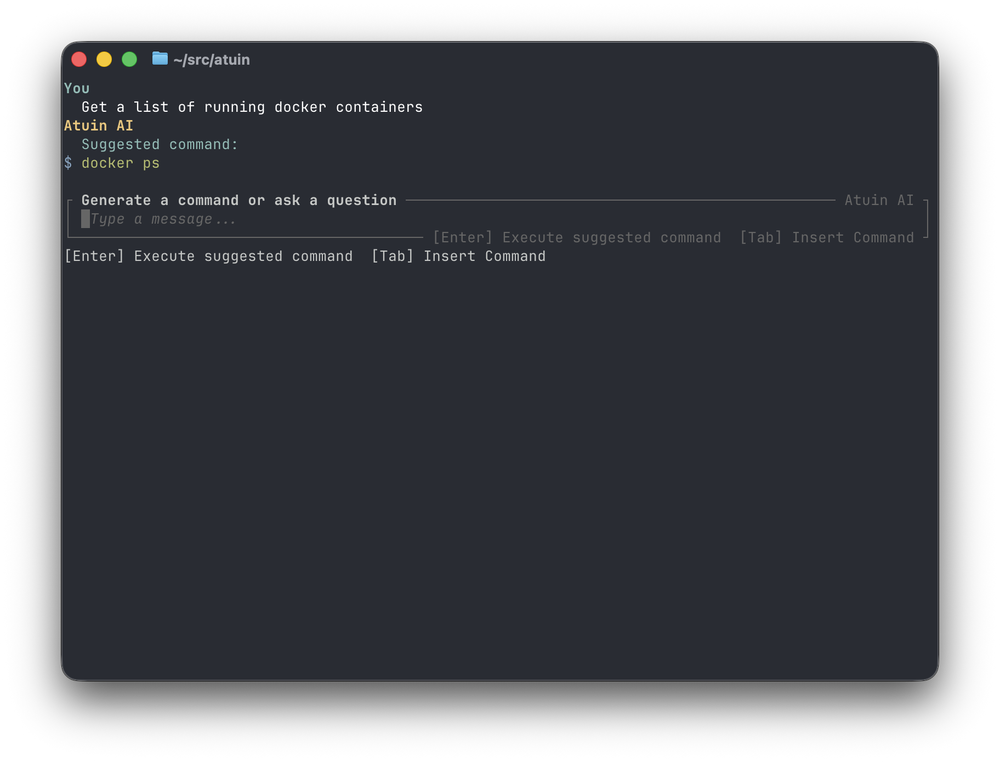
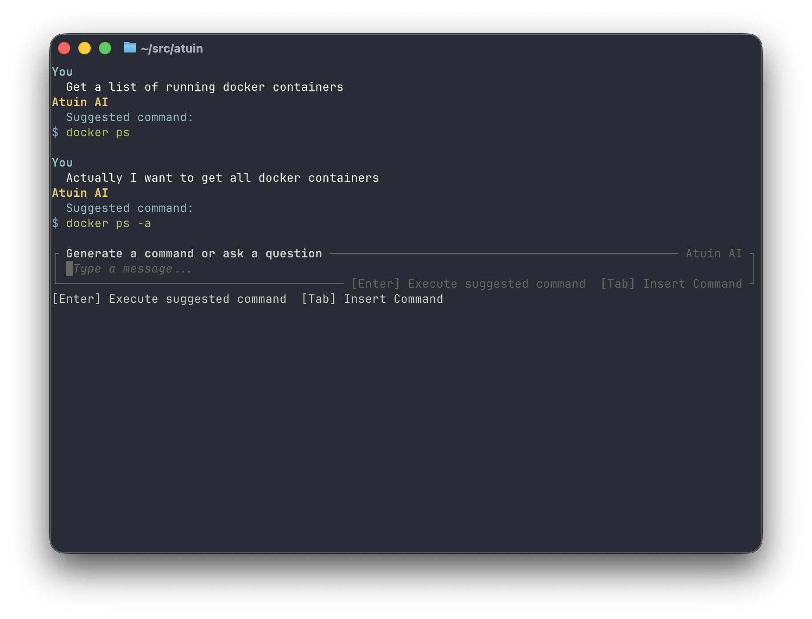
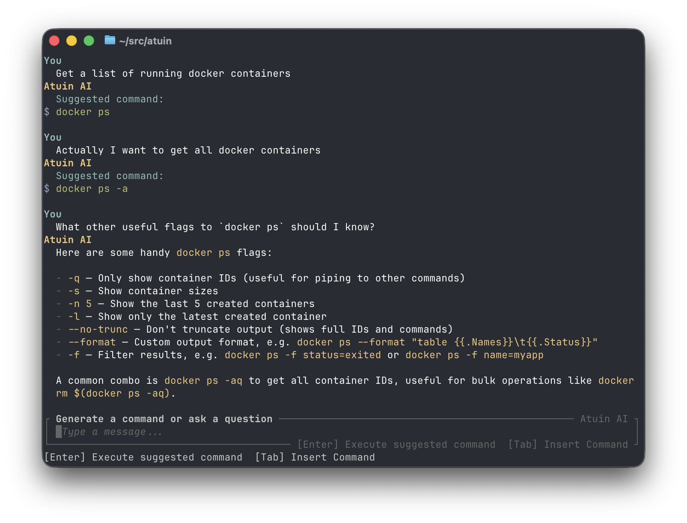
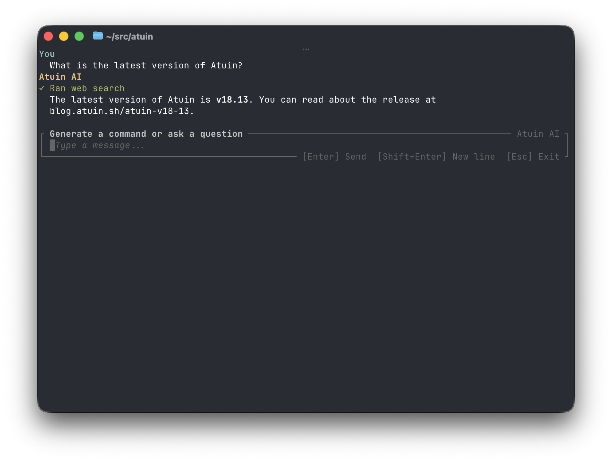
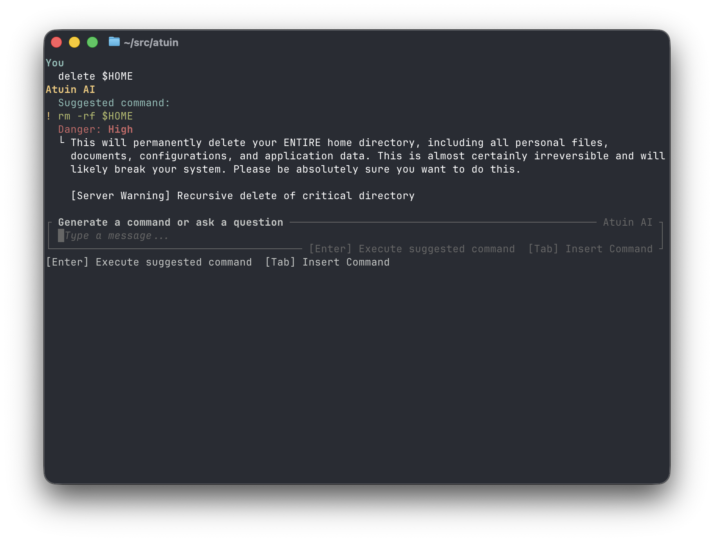

# Atuin AI

Atuin AI is a subcommand that enables shell command generation and other information lookup via an LLM directly from your terminal.

Atuin AI requires an account on [Atuin Hub](https://hub.atuin.sh/), and you'll be prompted to login upon first use of the binary.

## Getting Started

Atuin AI currently supports zsh, bash, and fish shells. Your shell's usual `atuin init` call will automatically bind the question mark key to the Atuin AI UI (only when the prompt is empty).

!!! note "Disabling Atuin AI"

    You can disable the default question mark key binding by passing `--disable-ai` to your shell's `atuin init` call.

## Settings

For a list of settings that control the behavior of Atuin AI, see [its dedicated settings documentation](./settings.md).

## Features

### Command generation

Prompt the LLM to create a command, and get one back, no fuss. Press `enter` to run, or `tab` to insert.

### Follow-up

You can follow-up with a refinement prompt to update the command that will be inserted.

You can also follow-up with questions to get responses in natural language.

You can still use `enter` or `tab` to run or insert the last suggested command, even if it was suggested in a previous turn.

### Conversational and search usage

If you prompt the LLM with a question that doesn't imply you want to generate a command, it can respond in natural language, and use web search if necessary to fetch the data it needs.

### Dangerous or low-confidence command detection

The LLM scores its confidence in the command, as well as how dangerous the command is. This information is shown if a threshold is exceeded, and requires an extra confirmation step before running automatically with `enter`.

The Atuin Hub server also monitors suggested commands for dangerous patterns the LLM didn't catch, and appends its own assessment at the end of the LLM's own assessment.

