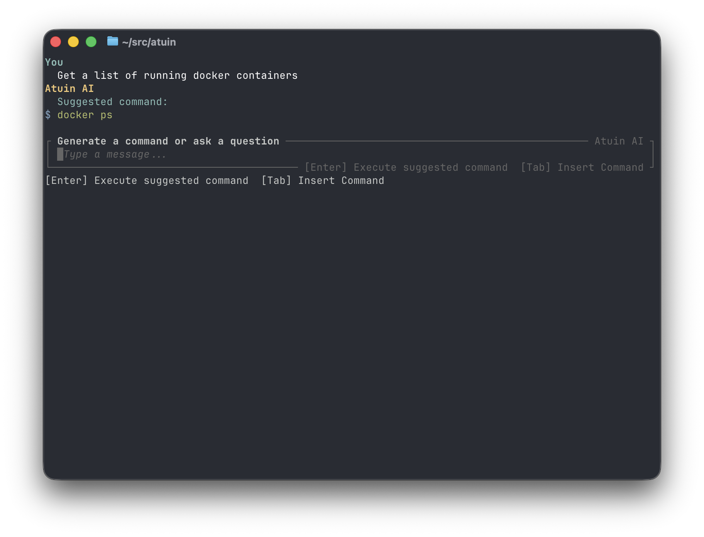
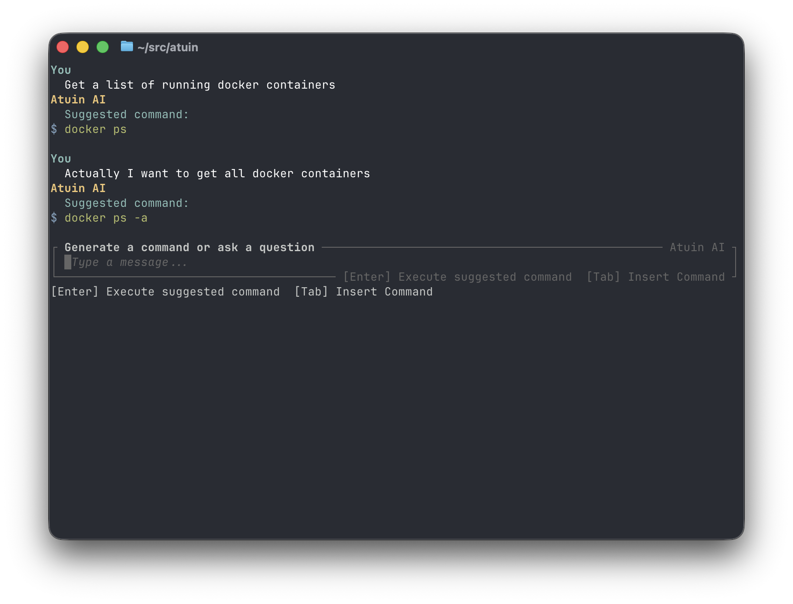
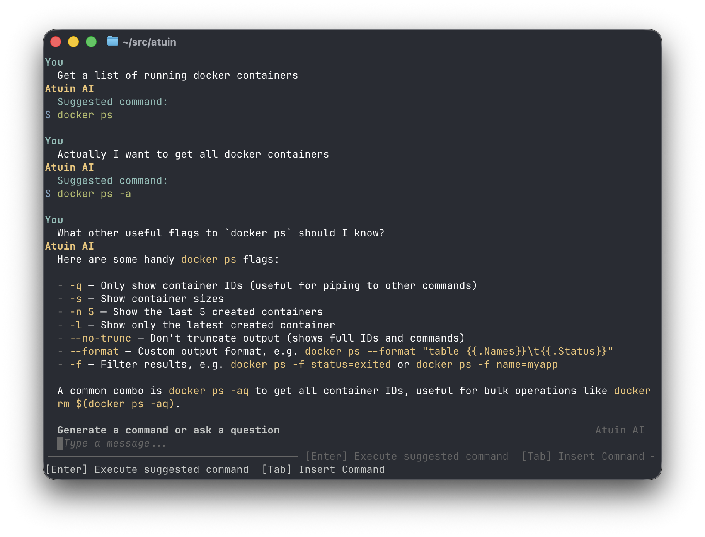
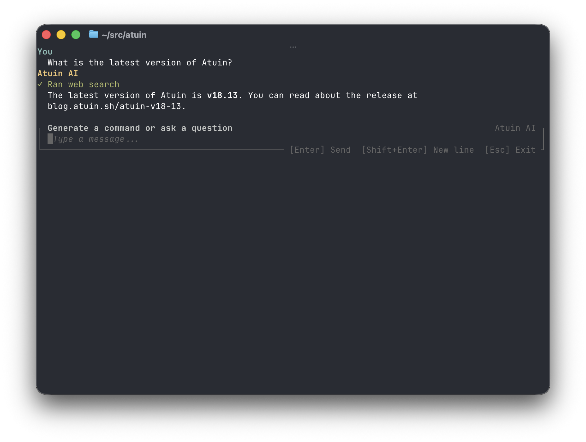
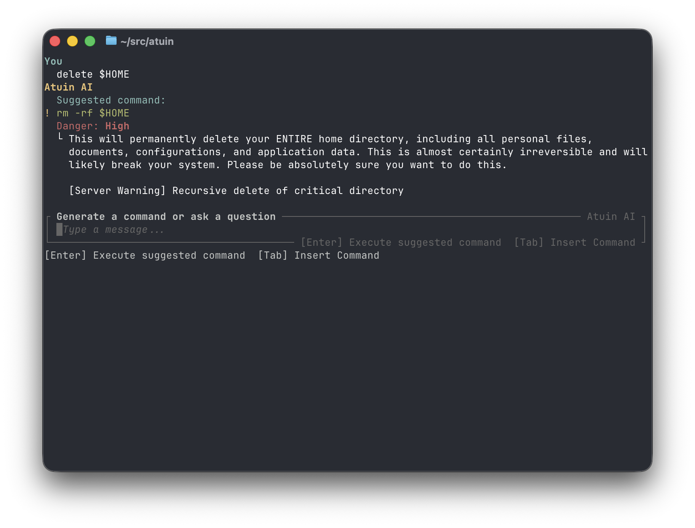

# Atuin AI

Atuin AI is a subcommand. It uses an LLM to generate shell commands and to find other information, directly from your terminal.

Atuin AI requires an account on [Atuin Hub](https://hub.atuin.sh/), and Atuin asks you to log in upon first use of the binary. Alternatively, you can [self-host the Atuin AI backend](./self-hosting.md).

Usage of Atuin AI is currently free.

## Getting Started

Atuin AI currently supports zsh, bash, and fish shells. See
[Supported platforms](../support.md) for the full support matrix. Your shell's usual `atuin init` call will automatically bind the question mark key to the Atuin AI UI (only when the prompt is empty).

!!! note "Disabling Atuin AI"

    You can disable the default question mark key binding by passing `--disable-ai` to your shell's `atuin init` call, or by setting `ai.enabled` to `false` in your Atuin config.

## Settings

For a list of settings that control the behavior of Atuin AI, see [its dedicated settings documentation](./settings.md).

## Features

### Command generation

Prompt the LLM to create a command, and get one back, no fuss. Press `enter` to run, or `tab` to insert.

### Follow-up

You can follow-up with another prompt to update the command that will be inserted.

You can also follow-up with questions to get responses in natural language.

You can still use `enter` or `tab` to run or insert the last suggested command, even if the LLM suggested it in a previous turn.

### Conversational and search usage

If your question does not ask for a command, the LLM answers in natural language. It can also use web search to get the data that it needs.

### Dangerous or low-confidence command detection

The LLM scores its confidence in the command and how dangerous the command is. This information is shown if a threshold is exceeded, and requires an extra confirmation step before running automatically with `enter`.

The Atuin Hub server also examines the suggested commands for dangerous patterns that the LLM did not find. It adds its own assessment after the assessment of the LLM.

