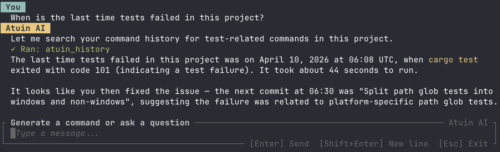
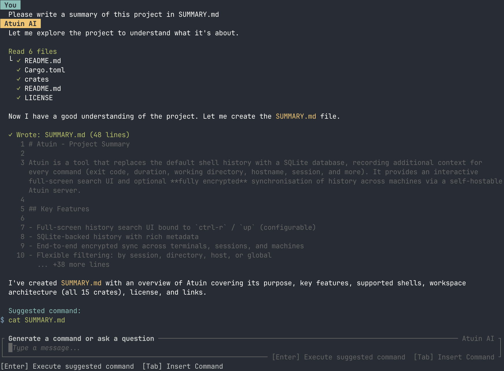
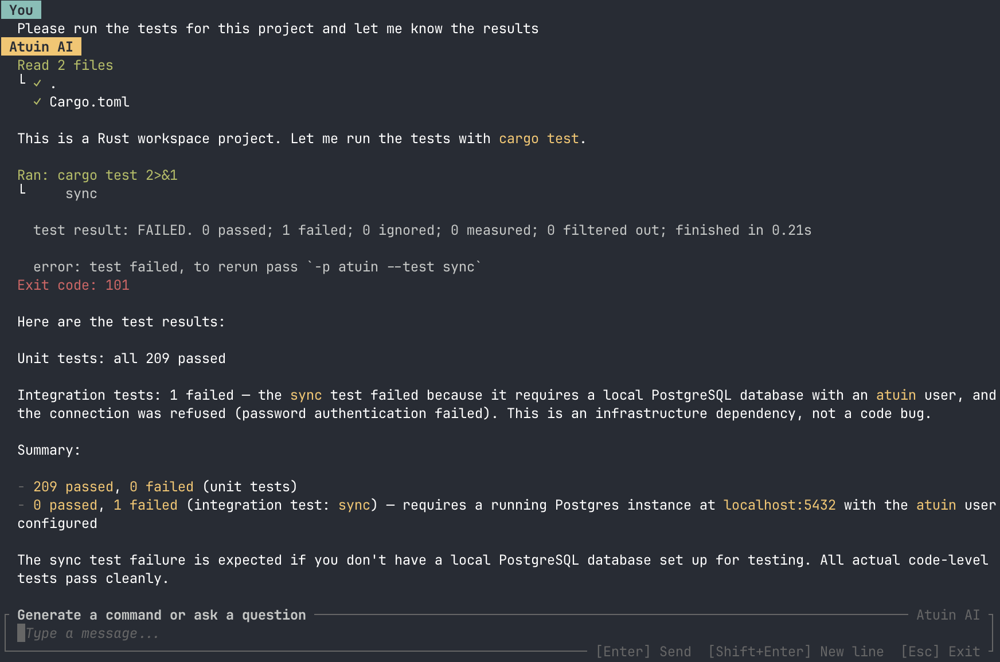

# Atuin AI Tools & Permissions

Atuin AI has several tools that it can use to interact with your system, given your permission. The AI can use these tools to help answer questions and perform actions on your behalf.

## Permission System

By default, Atuin AI asks your permission before using any client-side tool. You can change these defaults using a _permission file_.

### Permission Files

Permission files live at `.atuin/permissions.ai.toml` in any project. When the AI wants to run a tool, Atuin AI looks for permission files in this order:

1. `.atuin/permissions.ai.toml` in the working directory
2. The same file in each parent directory, up to the root of the filesystem
3. `permissions.ai.toml` in the Atuin config directory (`~/.config/atuin/permissions.ai.toml` by default)

A permission file is a TOML file with the following format:

```toml
[permissions]

allow = [
    # rules for automatically allowed tools
]

deny = [
    # rules for automatically denied tools
]

ask = [
    # rules for tools that require asking for permission
]
```

If Atuin AI does not find a matching rule, it defaults to asking for permission before running the tool.

A permission file deeper in the filesystem has priority over one higher up. For example, a file in the working directory allows a tool. A file in a parent directory denies the same tool. Atuin AI allows the tool.

In one permission file, `ask` rules have priority over `deny` rules, and `deny` rules have priority over `allow` rules. For example, a file allows a tool and also asks for permission for the same tool. Atuin AI asks for permission before it runs the tool.

### Permission Scopes

Most rules can be scoped to a particular path or other context. For example, you can allow Atuin AI to read files in a particular directory, but not in others. For rules about file operations, the scope is a glob pattern that matches file paths.

### Example Config

This example permission file lets Atuin AI read and write the markdown files in the current project, because Write implies Read (see below). It denies all access to `.env` files. For any _other_ file, Atuin AI asks for permission first.

```toml
[permissions]

allow = [
    "Write(**/*.md)"
]

deny = [
    "Read(.env)"
]
```

## Tools

### Atuin History

The `AtuinHistory` tool lets Atuin AI search your Atuin history for related commands. This tool is read-only. Atuin AI can ask to use it when you:

- Ask it to recall a command that you ran in the past
- Ask for information about such a command
- Ask for help with a failing command (for example, "why did my last command fail?")



**Permission rule and scope:** `AtuinHistory`

**Config value:** `ai.capabilities.enable_history_search` (see [settings documentation](./settings.md#capabilities))

**Example permissions file:**

```toml
[permissions]

allow = ["AtuinHistory"]
```

### Atuin Output

The `AtuinOutput` tool lets Atuin AI read the captured output of commands in your Atuin history. This tool is read-only. Atuin AI can ask to use it when you ask about the result of a command that you ran. It can also ask when you need help with a failing command.

Output capture needs the daemon and pty-proxy. See [Reading Command Output](./command-output.md).

**Permission rule and scope:** `AtuinOutput`

**Config value:** `ai.capabilities.enable_history_output` (see [settings documentation](./settings.md#capabilities))

**Example permissions file:**

```toml
[permissions]

allow = ["AtuinOutput"]
```

### Read

The `Read` tool lets Atuin AI read files on your system. Atuin AI can ask to use it when you:

- Ask it to analyze the contents of a file
- Ask for edits to the contents of a file
- Ask a question that the contents of a file can answer



**Permission rule and scope:** `Read(<glob_pattern>)` (for example, `Read(**/*.md)` to allow reading all markdown files in the current directory and subdirectories). A missing glob pattern (for example, `Read`) matches all files.

**Config value:** `ai.capabilities.enable_file_tools` (see [settings documentation](./settings.md#capabilities)) — this setting enables both the `Read` and `Write` tools.

**Example permissions file:**

```toml
[permissions]
allow = ["Read(**/*.md)"]
deny = ["Read(.secret/**)"]
```

!!! warning "Write Implies Read"

    To prevent accidental data loss, Atuin AI is required to read the contents of a file before writing to it. This means that any permission rule that allows the `Write` tool for a particular file or set of files will also automatically allow the `Read` tool for those same files. For example, if you have a rule that allows `Write(**/*.md)`, Atuin AI will also be able to read any markdown files in the current directory and subdirectories, even if you do not have an explicit rule that allows `Read(**/*.md)`.

### Write

The `Write` tool allows Atuin AI to create and edit files on your system. Atuin AI might ask to use this tool when you ask it to update configuration for a tool or help debug a problem.


**Permission rule and scope:** `Write(<glob_pattern>)` (for example, `Write(**/*.md)` to allow writing all markdown files in the current directory and subdirectories). A missing glob pattern (for example, `Write`) matches all files.

**Config value:** `ai.capabilities.enable_file_tools` (see [settings documentation](./settings.md#capabilities)) — this setting enables both the `Read` and `Write` tools.

**Example permissions file:**

```toml
[permissions]
allow = ["Write(**/*.md)"]
deny = ["Write(.secret/**)"]
```

!!! note "File Backups"

    The first time Atuin AI writes to a file in a session, it creates a backup of the original file and stores it in Atuin's data directory, under `ai/sessions/<session_id>`. A manifest file in that directory maps the original file paths to the backup file paths. In the future, we will provide easier ways to recover from accidental data loss.

### Shell Command Execution

The `Shell` tool lets Atuin AI run shell commands on your system. Atuin AI can ask to use it when you:

- Ask for an action that a shell command does best
- Ask for help to debug a failing command
- Run a workflow that has more than one step



**Permission rule and scope:** `Shell(<command pattern>)` (for example, `Shell(git *)` to allow any command that starts with `git`). A missing command pattern (for example, `Shell`) matches all commands.

**Config value:** `ai.capabilities.enable_command_execution` (see [settings documentation](./settings.md#capabilities))

**Example permissions file:**

```toml
[permissions]
allow = [
    "Shell(git add *)",
    "Shell(git commit *)"
]
```

!!! note "Command Execution Scope"

    The command pattern in a `Shell` permission rule is matched against the words in the command. The `*` wildcard has different behavior depending on where it appears:

    | Pattern | Matches | Does not match |
    |---------|---------|----------------|
    | `*` | Any command | — |
    | `git commit *` | `git commit`, `git commit -m "msg"` | `git`, `git push` |
    | `ls*` | `ls`, `ls -a`, `lsof` | `cat` |
    | `git * --amend` | `git commit --amend`, `git rebase --amend` | `git commit` |
    | `git commit` | `git commit` | `git`, `git push`, `git commit -m "msg"` |

    Note the difference between `ls *` (with a space) and `ls*` (without). The space-separated form uses **word-boundary** matching — `ls *` matches `ls` and `ls -a` but _not_ `lsof`. The attached form uses **prefix** matching — `ls*` matches all of those, including `lsof`.

    For `allow` and `ask` rules, a pattern without any wildcard (for example, `git commit`) is an **exact match** — it only matches when the command words are identical. Use `git commit *` if you want to allow `git commit` with any arguments.

    For `deny` rules, a pattern without any wildcard (for example, `rm`) is a **prefix match** — it matches any command that starts with that prefix. This means that a `deny` rule of `rm` would deny `rm`, `rm -rf /`, and `rm ./README.md` so be careful when writing `deny` rules without explicit wildcards.

!!! warning "Compound Commands"

    When the AI runs a compound command (for example, `git add . && npm test`), Atuin parses it into individual subcommands. For a command to be automatically allowed, all subcommands must be allowed. This means that `git add . && npm test` must be enabled by both `Shell(git add *)` and `Shell(npm test)` for it to be allowed, else it would fall through and ask for permission. But our parsing is not perfect. In some cases it does not identify the subcommands correctly, and in some shells the command parsing is worse. For this reason, we recommend being cautious when allowing compound commands with broad patterns.
