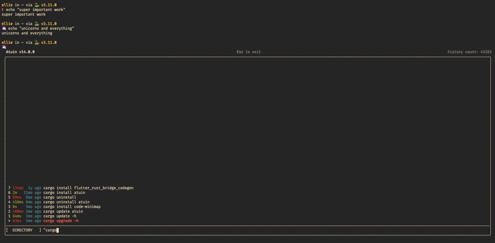
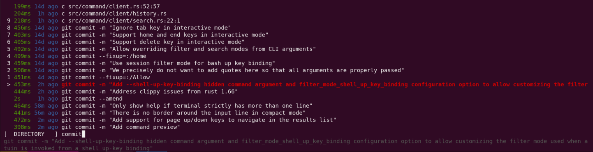

# Config

Atuin maintains two configuration files, stored in `~/.config/atuin/`. We store
data in `~/.local/share/atuin` (unless overridden by XDG\_\*).

You can also change the path to the configuration directory by setting
`ATUIN_CONFIG_DIR`. For example

```
export ATUIN_CONFIG_DIR = /home/ellie/.atuin
```

## Client config

```
~/.config/atuin/config.toml
```

The client runs on a user's machine, and unless you're running a server, this
is what you care about.

See [config.toml](../../../atuin-client/config.toml) for an example

### `db_path`

The path to the Atuin SQlite database. Defaults to
`~/.local/share/atuin/history.db`.

```
db_path = "~/.history.db"
```

### `key_path`

The path to the Atuin encryption key. Defaults to
`~/.local/share/atuin/key`.

```
key = "~/.atuin-key"
```

### `session_path`

The path to the Atuin server session file. Defaults to
`~/.local/share/atuin/session`. This is essentially just an API token

```
key = "~/.atuin-session"
```

### `dialect`

This configures how the [stats](../commands/stats.md) command parses dates. It has two
possible values

```
dialect = "uk"
```

or

```
dialect = "us"
```

and defaults to "us".

### `auto_sync`

Configures whether or not to automatically sync, when logged in. Defaults to
true

```
auto_sync = true/false
```

### `update_check`

Configures whether or not to automatically check for updates. Defaults to
true.

```
update_check = true/false
```

### `sync_address`

The address of the server to sync with! Defaults to `https://api.atuin.sh`.

```
sync_address = "https://api.atuin.sh"
```

### `sync_frequency`

How often to automatically sync with the server. This can be given in a
"human-readable" format. For example, `10s`, `20m`, `1h`, etc. Defaults to `1h`.

If set to `0`, Atuin will sync after every command. Some servers may potentially
rate limit, which won't cause any issues.

```
sync_frequency = "1h"
```

### `search_mode`

Which search mode to use. Atuin supports "prefix", "fulltext", "fuzzy", and
"skim" search modes.

Prefix mode searches for "query\*"; fulltext mode searches for "\*query\*";
"fuzzy" applies the [fuzzy search syntax](#fuzzy-search-syntax);
"skim" applies the [skim search syntax](https://github.com/lotabout/skim#search-syntax).

Defaults to "fuzzy".

#### `fuzzy` search syntax

The "fuzzy" search syntax is based on the
[fzf search syntax](https://github.com/junegunn/fzf#search-syntax).

| Token     | Match type                 | Description                          |
|-----------|----------------------------|--------------------------------------|
| `sbtrkt`  | fuzzy-match                | Items that match `sbtrkt`            |
| `'wild`   | exact-match (quoted)       | Items that include `wild`            |
| `^music`  | prefix-exact-match         | Items that start with `music`        |
| `.mp3$`   | suffix-exact-match         | Items that end with `.mp3`           |
| `!fire`   | inverse-exact-match        | Items that do not include `fire`     |
| `!^music` | inverse-prefix-exact-match | Items that do not start with `music` |
| `!.mp3$`  | inverse-suffix-exact-match | Items that do not end with `.mp3`    |

A single bar character term acts as an OR operator. For example, the following
query matches entries that start with `core` and end with either `go`, `rb`,
or `py`.

```
^core go$ | rb$ | py$
```

### `filter_mode`

The default filter to use when searching

| Column1          | Column2                                                      |
|------------------|--------------------------------------------------------------|
| global (default) | Search history from all hosts, all sessions, all directories |
| host             | Search history just from this host                           |
| session          | Search history just from the current session                 |
| directory        | Search history just from the current directory               |

Filter modes can still be toggled via ctrl-r

```
filter_mode = "host"
```

### `filter_mode_shell_up_key_binding`

The default filter to use when searching and being invoked from a shell up-key binding.

Accepts exactly the same options as `filter_mode` above

```
filter_mode_shell_up_key_binding = "session"
```

Defaults to the value specified for filter_mode.

### `style`

Which style to use. Possible values: `auto`, `full` and `compact`.

- `compact`:


- `full`:


Defaults to `auto`.

### `inline_height`

Set the maximum number of lines Atuin's interface should take up.



If set to `0` (default), Atuin will always take up as many lines as available (full screen).

### `show_preview`

Configure whether or not to show a preview of the selected command.



Useful when the command is longer than the terminal width and is cut off.

### `show_help`

Configure whether or not to show the help row, which includes the current Atuin version (and whether an update is available), a keymap hint, and the total amount of commands in your history.

Defaults to `true`.

### `exit_mode`

What to do when the escape key is pressed when searching

| Value                     | Behaviour                                                        |
|---------------------------|------------------------------------------------------------------|
| return-original (default) | Set the command-line to the value it had before starting search  |
| return-query              | Set the command-line to the search query you have entered so far |

Pressing ctrl+c or ctrl+d will always return the original command-line value.

```
exit_mode = "return-query"
```

### history_filter

The history filter allows you to exclude commands from history tracking - maybe you want to keep ALL of your `curl` commands totally out of your shell history, or maybe just some matching a pattern.

This supports regular expressions, so you can hide pretty much whatever you want!

```
## Note that these regular expressions are unanchored, i.e. if they don't start
## with ^ or end with $, they'll match anywhere in the command.
history_filter = [
   "^secret-cmd",
   "^innocuous-cmd .*--secret=.+"
]
```
