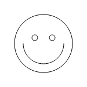

# 2D Canvas

[View full source code][code] or [view the compiled example online][online]

[online]: https://rustwasm.github.io/wasm-bindgen/exbuild/canvas/
[code]: https://github.com/rustwasm/wasm-bindgen/tree/master/examples/canvas

Drawing a smiley face with the 2D canvas API. This is a port of part of [this
MDN
tutorial](https://developer.mozilla.org/en-US/docs/Web/API/Canvas_API/Tutorial/Drawing_shapes#Moving_the_pen)
to `web-sys`.



## `Cargo.toml`

The `Cargo.toml` enables features necessary to query the DOM and work with 2D
canvas.

```toml
{{#include ../../../examples/canvas/Cargo.toml}}
```

## `src/lib.rs`

Gets the `<canvas>` element, creates a 2D rendering context, and draws the
smiley face.

```rust
{{#include ../../../examples/canvas/src/lib.rs}}
```
